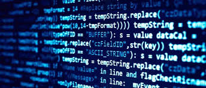

<h1>Sıfırdan Yazılım Mühendisi & Uzmanı Yetiştirme ve Geliştirme Programı</h1>
<h2>Omer Kafkas Yazilim Uzmanligi 21 Aralik 2024 Baslangic Tarihli Eğitim</h2>
<h3>-Yazılıma Giriş ve Temel Kavramlar</h3>
<h3>-C# ile Programlamaya Giriş</h3>

-Nesneye Dayalı Programlama (OOP)

<h3>-MS SQL Server Veritabanı Sorgulama, Programlama ve Yönetimi</h3>

-SQL Server İleri Seviye Konular

-NoSQL ile Veritabanı Yönetimi ve Sorgulama

<h3>-Windows Form ile Görsel Programlamaya Giriş</h3>

-Giriş / Çıkış (Dosya) İşlemleri

<h3>-Front-End Programlama (Web Programlama / HTML & CSS) HTML</h3>

-CSS

-JAVASCRIPT & JQUERY

-JAVASCRIPT

-JQUERY

-TypeScript Dili ve Angular Programlama

-Node.JS ile Uygulama Geliştirme

-Web API ile Uygulama Geliştirme

